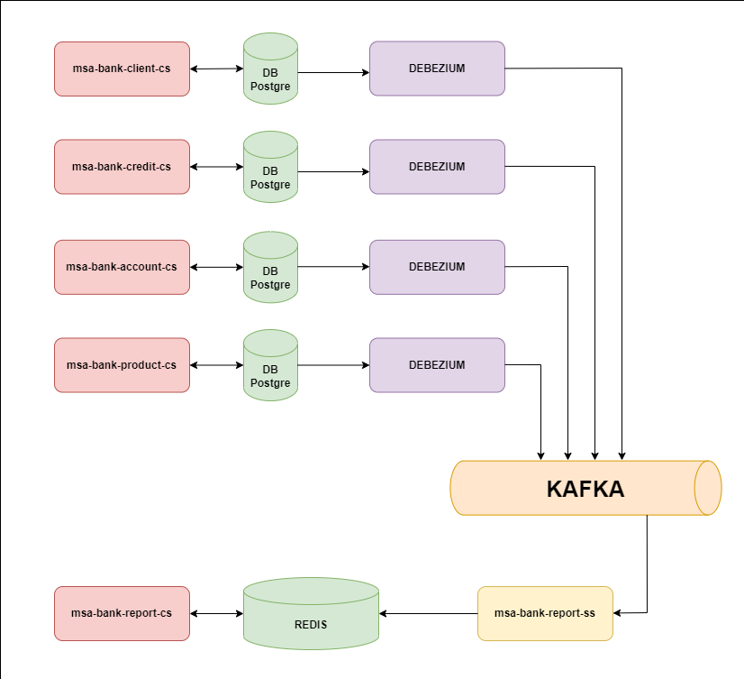

# msa-bank

Проект-акселератор для Go-разработчиков "Выдача кредита"

  
[Ссылка на проект на neowiki](https://neowiki.neoflex.ru/pages/viewpage.action?pageId=108997075)  
  
1. msa-bank-credit-cs:
    * предварительный расчет графика платежей
    * создание кредита
    * создание заявки на досрочное погашение
    * создание заявки на полное погашение
2. msa-bank-client-cs:
    * заведение нового клиента
    * получение данных по клиенту
3. msa-bank-account-cs
    * открытие нового счета
    * получение информации по счету
    * изменение счета
4. msa-bank-report-cs
    * получение детальной информации по клиенту и его продуктам
5. msa-bank-product-cs
    * создание нового продукта
    * получение информации по продукту

Используемые технологии:
  
**Общие для всех микросервисов**  
Go 1.18  
https://github.com/golang-migrate/migrate  
https://gorm.io/  
  
**msa-bank-account-cs**  
https://github.com/gorilla/mux  
https://github.com/deepmap/oapi-codegen  
  
**msa-bank-client-cs**  
https://pkg.go.dev/net/http  
https://github.com/go-swagger/go-swagger  
  
**msa-bank-credit-cs**  
https://github.com/labstack/echo  
https://github.com/deepmap/oapi-codegen  
  
**msa-bank-product-cs**  
https://pkg.go.dev/net/http  
https://github.com/sirupsen/logrus  
https://github.com/go-swagger/go-swagger  
  
**msa-bank-report-cs**  
https://github.com/gorilla/mux  
https://github.com/redis/go-redis  
https://github.com/sirupsen/logrus  
https://github.com/qax-os/excelize  
https://github.com/deepmap/oapi-codegen  
  
**msa-bank-report-ss**  
https://github.com/redis/go-redis  
https://github.com/segmentio/kafka-go  